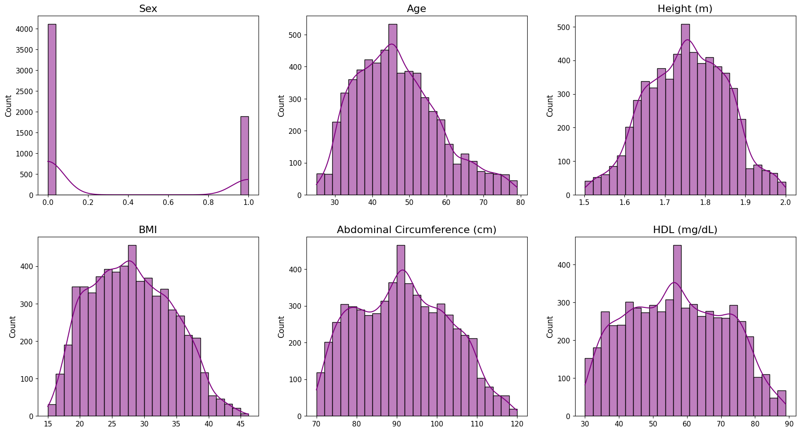
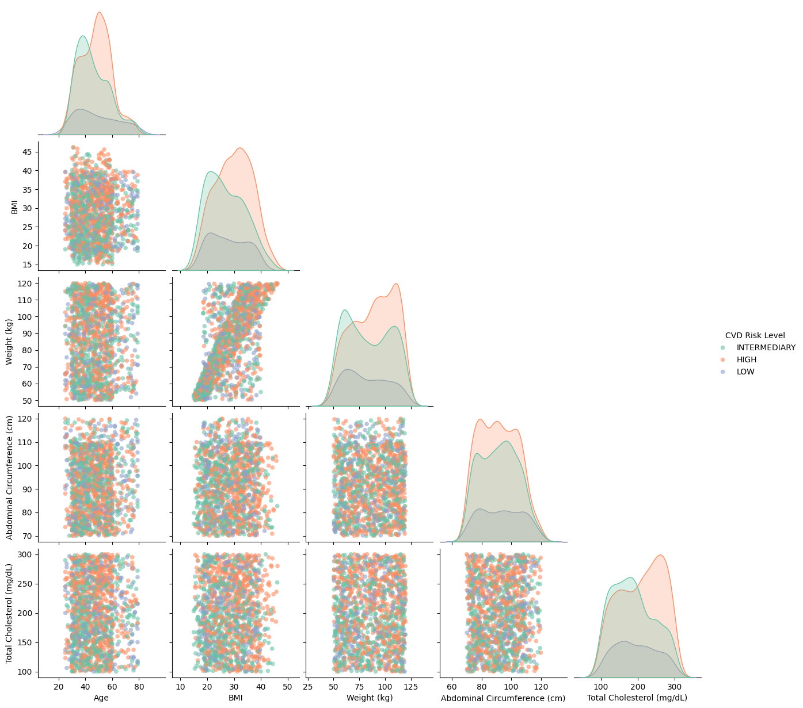
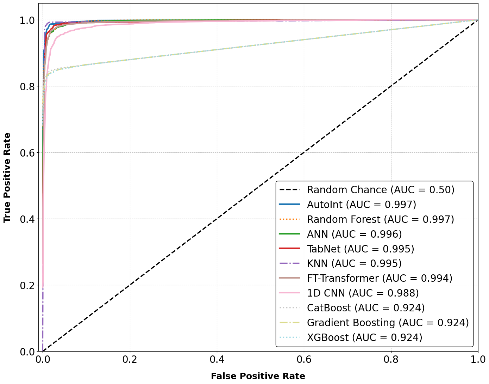
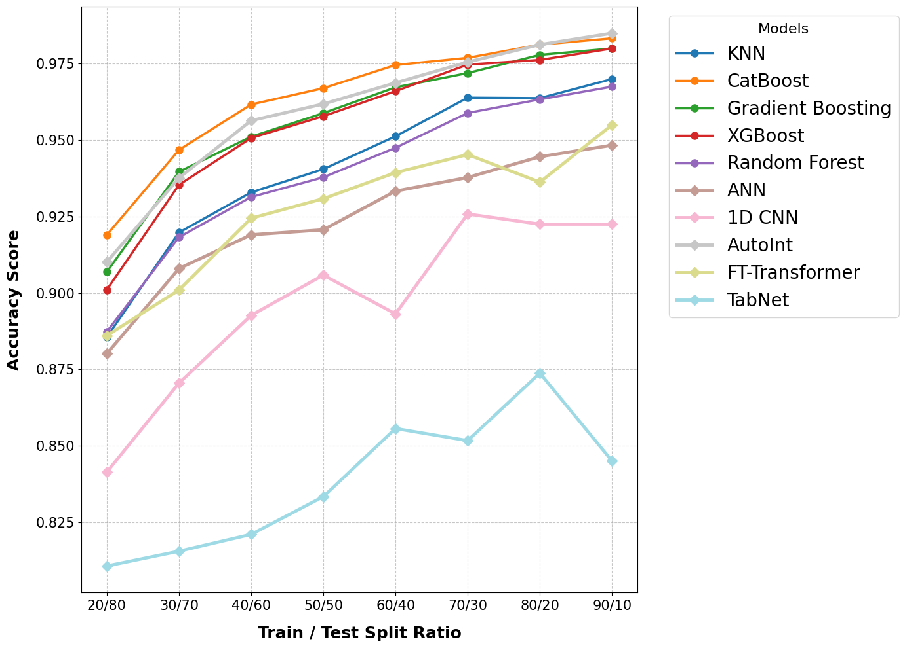
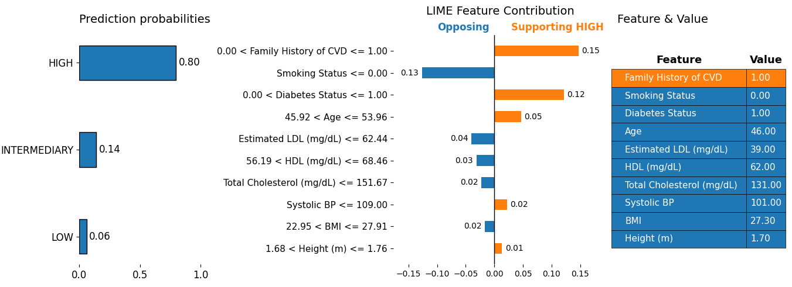
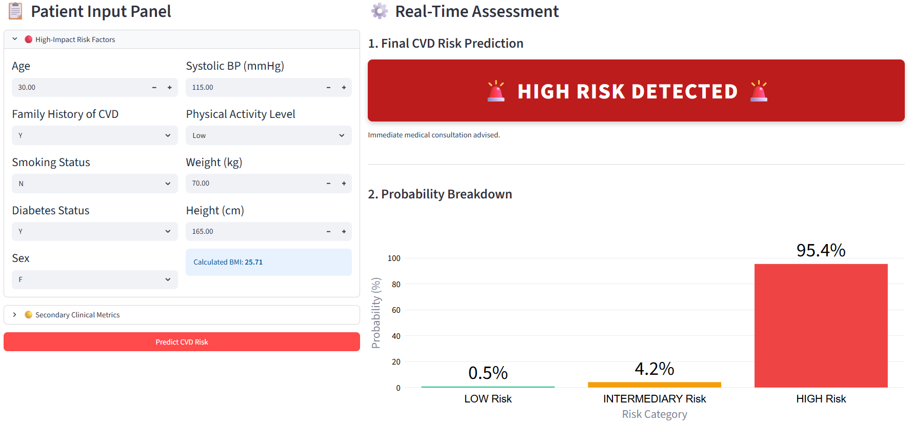

# Cardiovascular Disease

---

### Live Deployment & Interactive Interface
To experience the clinical dashboard in real-time, access the hosted instances below:

> **Web URL:** https://cardio-diseases.streamlit.app/

---

### Comprehensive Clinical Benchmarks & Data Repositories

The robustness of this pipeline is validated against multiple independent cohorts. You can access the foundational data sources directly:

* **Main Dataset:**  — [Cohort Dataset 1 (Mendeley)](https://data.mendeley.com/datasets/d9scg7j8fp/1)

* **External Cross-Validation dataset (Cohort 1):**  — [Secondary Dataset 1 (Mendeley)](https://data.mendeley.com/datasets/vhgyn5yk4g/1)

* **External Cross-Validation dataset (Cohort 2):**  — [Cardiovascular Disease Dataset (Kaggle)](https://www.kaggle.com/datasets/sulianova/cardiovascular-disease-dataset)

---

# Algorithmic Framework: Exploratory Data Analysis (EDA) Pipeline

This document presents the detailed, step-by-step procedure for the Exploratory Data Analysis (EDA) and initial data cleaning pipeline implemented using Python in a Jupyter Notebook environment.

---

## Algorithm: Data Inspection, Quality Assurance, and Attribute Transformation

**Algorithm: Exploratory Data Analysis and Feature Standardization** **Input:** Raw Dataset (CVD Dataset.csv)  
**Output:** Cleaned, Imputed, and Structurally Transformed DataFrame (df)  

* **Step 1: Data Acquisition and Structural Ingestion:** Load the raw dataset into a master DataFrame (df) using pandas.
* **Step 2: Metadata and Shape Inspection:** Extract and analyze dataset dimensions (shape), feature nomenclature (columns), and data-type configurations (info).
### Dataset Schema and Structural Architecture

The primary dataset comprises **1,529 observations** and **22 statistical attributes** (features). Below is the formalized structural mapping of the variables used during the Exploratory Data Analysis (EDA) and Modeling phases:

| Attribute Name | Data Type | Description & Operational Category |
| :--- | :--- | :--- |
| **Sex** | Categorical | Biological sex of the participant. |
| **Age** | Numerical | Continuous chronological age profile. |
| **Weight (kg)** | Numerical | Continuous mass measurement. |
| **Height (m)** | Numerical | Original height metric. |
| **BMI** | Numerical | Body Mass Index ($kg/m^2$) (Calculated metric). |
| **Abdominal Circumference (cm)** | Numerical | Waist/abdominal girth distribution. |
| **Blood Pressure (mmHg)** | Categorical | Raw blood pressure values (e.g., "120/80"). |
| **Total Cholesterol (mg/dL)** | Numerical | Serum total cholesterol concentration. |
| **HDL (mg/dL)** | Numerical | High-Density Lipoprotein profile. |
| **Fasting Blood Sugar (mg/dL)** | Numerical | Glycemic profile measurement. |
| **Smoking Status** | Categorical | Behavioral metric tracking tobacco usage. |
| **Diabetes Status** | Categorical | Clinical categorization of diabetic condition. |
| **Physical Activity Level** | Categorical | Behavioral score of physical engagement. |
| **Family History of CVD** | Categorical | Genetic predisposition indicator for Cardiovascular Disease. |
| **CVD Risk Level** | Categorical | **Target Label** mapped to ordinal states ('Low', 'Medium', 'High'). |
| **Height (cm)** | Numerical | Transformed height distribution vector. |
| **Waist-to-Height Ratio** | Numerical | Anthropometric index for central obesity. |
| **Systolic BP** | Numerical | Extracted peak arterial pressure component. |
| **Diastolic BP** | Numerical | Extracted minimum arterial pressure component. |
| **Blood Pressure Category** | Categorical | Categorized clinical state (e.g., Normal, Hypertension). |
| **Estimated LDL (mg/dL)** | Numerical | Calculated Low-Density Lipoprotein value. |
| **CVD Risk Score** | Numerical | Redundant/Leaking continuous risk value. |

---

  
* **Step 3: Duplicate Resolution:** Compute the total number of duplicate row vectors using df.duplicated().sum() and purge them.
* **Step 4: Missing Value Identification:** Execute df.isnull().sum() to detect and count the frequency of null vectors.
* **Step 5: Distribution Shape Analysis:** Calculate Skewness and Kurtosis metrics, and generate Boxplots for continuous variables.
* **Step 6: Statistical Imputation Strategy:** Replace continuous null fields with the column **Mean** and nominal/categorical null fields with the column **Mode**.
* **Step 7: Leaking Feature Elimination:** Drop structural columns causing data leakage: `['CVD Risk Score', 'Systolic BP', 'Diastolic BP']`.
* **Step 8: Feature Deconstruction:** Split composite string variable 'Blood Pressure (mmHg)' into separate 'Systolic BP' and 'Diastolic BP' vectors and drop the original.
* **Step 9: Outlier Mitigation:** Compute continuous Z-score profile and drop observations where the absolute threshold exceeds 3 (|Z-score| > 3).
* **Step 10: Behavioral and Density Visualization:** Construct Histograms to assess data density distributions.
  
  

    
  

  
  Generate Dot Plots / Scatter Plots to evaluate behavioral patterns and correlations between variables.

  

    
  

* **Step 11: Target Class Distribution:** Seeing class distribution for model training.

  

    
  

* **Step 12: Hybrid Feature Encoding:** Categorical attributes must be transformed into mathematical vectors based on their intrinsic scale. Apply Custom Map Encoding (CME) to ordinal features with structural sequences to preserve hierarchy. Apply Label Encoding (LE) exclusively to binary attributes or target metrics like CVD Risk Level. Implement One-Hot Encoding (OHE) with dummy variable elimination (drop_first=True) for all remaining nominal features to prevent collinearity issues.

| Attribute Name | Data Type | Encoding Strategy |
| :--- | :--- | :--- |
| **Sex** | Categorical | One-Hot Encoding |
| **Age** | Numerical | Custom Mapping Encoding |
| **Weight (kg)** | Numerical | Custom Mapping Encoding |
| **Height (m)** | Numerical | Custom Mapping Encoding |
| **BMI** | Numerical | Custom Mapping Encoding |
| **Abdominal Circumference (cm)** | Numerical | Custom Mapping Encoding |
| **Blood Pressure (mmHg)** | Categorical | Label Encoding |
| **Total Cholesterol (mg/dL)** | Numerical | Custom Mapping Encoding |
| **HDL (mg/dL)** | Numerical | Custom Mapping Encoding |
| **Fasting Blood Sugar (mg/dL)** | Numerical | Custom Mapping Encoding |
| **Smoking Status** | Categorical | Label Encoding |
| **Diabetes Status** | Categorical |Label Encoding |
| **Physical Activity Level** | Categorical | Label Encoding |
| **Family History of CVD** | Categorical | Label Encoding|
| **CVD Risk Level** | Categorical | Custom Mapping Encoding *(Target)* |
| **Waist-to-Height Ratio** | Numerical | Custom Mapping Encoding |
| **Systolic BP** | Numerical | Custom Mapping Encoding |
| **Diastolic BP** | Numerical | Custom Mapping Encoding |
| **Blood Pressure Category** | Categorical | Label Encoding |
| **Estimated LDL (mg/dL)** | Numerical | Custom Mapping Encoding |

* **Step 13: Return DataFrame:** Return the refined and optimized DataFrame (df) for model training.

---

# Algorithmic Framework: Model Training, Optimization, and Validation Pipeline

This document presents the detailed, step-by-step mathematical and architectural pipeline implemented for model training, optimization, and strict evaluation in a Jupyter Notebook environment.

---

## Algorithm: Advanced Machine Learning and Deep Learning Validation Pipeline

**Input:** Preprocessed & Encoded Feature Matrix ($X_{encoded}$), Target Vector ($y$)

**Output:** Optimized Predictive Models, Performance Metrics, Robustness Profiles, and Feature Importances

* **Step 1: Initial Stratified Data Partitioning:** Split the encoded features and target vector into training and testing datasets using an **80/20** ratio, applying stratification to preserve class proportions.
* **Step 2: Feature Scaling & Normalization:** Initialize a `StandardScaler` on the training dataset to normalize continuous attributes ($z = \frac{x - \mu}{\sigma}$) and transform both train and test partitions to prevent data leakage.
* **Step 3: Class Imbalance Mitigation:** Apply **SMOTE** (Synthetic Minority Over-sampling Technique) exclusively to the scaled training dataset to generate synthetic observations for the minority classes.

| Target Class (CVD Risk Level) | Numerical Label | Before SMOTE (Raw Count) | After SMOTE (Resampled Count) | Sampling Delta (%) |
| :--- | :---: | :---: | :---: | :---: |
| **LOW** | `0` | 220 | 2,000 | +809.09% |
| **INTERMEDIARY** | `1` | 581 | 2,000 | +244.23% |
| **HIGH** | `2` | 728 | 2,000 | +174.73% |
| **Total Dataset Size** | — | **1,529** | **6,000** | **+292.41%** |

* **Step 4: Baseline Traditional Machine Learning Execution:** Train baseline configurations of **XGBoost, CatBoost, Random Forest, KNN, and Gradient Boosting** models, evaluating their performance via *Accuracy, Precision, Recall, and F1-Score*.

  ### 📊 Baseline Model Performance (Before Hyperparameter Tuning)

| Model Name | Accuracy | Precision | Recall | F1-Score |
| :--- | :---: | :---: | :---: | :---: |
| **XGBoost** | 0.9233 | 0.9236 | 0.9233 | 0.9234 |
| **CatBoost** | 0.9217 | 0.9216 | 0.9217 | 0.9216 |
| **Random Forest** | 0.9092 | 0.9094 | 0.9092 | 0.9088 |
| **Gradient Boosting** | 0.9008 | 0.9012 | 0.9008 | 0.8998 |
| **K-Nearest Neighbors (KNN)** | 0.7775 | 0.7768 | 0.7775 | 0.7767 |

* **Step 5: Hyperparameter Optimization via Bayesian Optimization:** Execute **Bayesian Optimization** across the hyperparameter space of the traditional models to discover optimal parameters. Retrain the optimized models and log their refined classification metrics.

### 🎯 Bayesian Hyperparameter Optimization & Post-Tuning Performance Matrix

| Model Name | Optimized Hyperparameters | Accuracy | Precision | Recall | F1-Score |
| :--- | :--- | :---: | :---: | :---: | :---: |
| **KNN** | `n_neighbors=3`, `weights='distance'`, `metric='manhattan'` | **0.9575** | **0.9575** | **0.9575** | **0.9573** |
| **CatBoost** | `iterations=489`, `depth=10`, `learning_rate=0.2936` | 0.9483 | 0.9483 | 0.9483 | 0.9482 |
| **Gradient Boosting** | `n_estimators=220`, `learning_rate=0.2592`, `max_depth=10` | 0.9392 | 0.9395 | 0.9392 | 0.9392 |
| **XGBoost** | `n_estimators=495`, `max_depth=10`, `learning_rate=0.1756`, `subsample=0.7624`, `colsample_bytree=0.9336` | 0.9292 | 0.9292 | 0.9292 | 0.9291 |
| **Random Forest** | `n_estimators=194`, `max_depth=19`, `min_samples_split=4`, `min_samples_leaf=1` | 0.9092 | 0.9093 | 0.9092 | 0.9089 |

* **Step 6: Advanced Deep Learning Pipeline for Tabular Data:** Construct and execute state-of-the-art tabular deep learning architectures including **AutoInt, ANN, CNN, FT-Transformer, and TabNet**. Evaluate their performance utilizing the same standard matrix (*Accuracy, Precision, Recall, F1-Score*).

### 🧬 Deep Learning & SOTA Tabular Models: Parameters & Performance Matrix

| Model Name | Architectural Taxonomy & Core Hyperparameters | Accuracy | Precision | Recall | F1-Score |
| :--- | :--- | :---: | :---: | :---: | :---: |
| **AutoInt** | **Self-Attentive Network:** `embed_dim=32`, `num_heads=4`, `num_layers=3`, `ffn_dropout=0.2`, `fc_dropout=0.3`. *Optimizer:* `AdamW` (lr=0.001, epochs=60) | **0.9758** | **0.9759** | **0.9758** | **0.9758** |
| **TabNet** | **Attentive Interpretable Tabular Network:** `n_d=64`, `n_a=64`, `n_steps=5`, `gamma=1.5`, `n_independent=2`, `n_shared=2`, `mask_type='entmax'`. *Optimizer:* `AdamW` (lr=0.02, epochs=100) | 0.9692 | 0.9692 | 0.9692 | 0.9692 |
| **FT-Transformer** | **Transformer-Based SOTA:** `embed_dim=64`, `num_heads=8`, `num_layers=3`, `dim_feedforward=256`, `dropout=0.2`. *Tokenizer:* `NumericalFeatureTokenizer` (lr=0.001, epochs=60) | 0.9600 | 0.9606 | 0.9600 | 0.9599 |
| **ANN** | **Multi-Layer Perceptron (MLP):** `Layers: 256 → 128 → 64`, `Dropout=0.3` (Layers 1 & 2), `Activation='ReLU'`. *Normalization:* `BatchNorm1d` (All Layers, epochs=60) | 0.9600 | 0.9603 | 0.9600 | 0.9598 |
| **1D CNN** | **Convolutional Neural Network:** `Conv1D_1: 32ch`, `Conv1D_2: 64ch (k=3, p=1)`, `Pooling: MaxPool1d(k=2)`, `FC_Dim=64`, `Dropout=0.3` (epochs=60) | 0.9346 | 0.9353 | 0.9346 | 0.9343 |

* **Step 7: Discriminative Capacity Evaluation:** Generate **Receiver Operating Characteristic (ROC) Curves** for all trained traditional and deep learning models and calculate the **ROC-AUC** scores to evaluate multi-class discrimination power.

  

    
  

  
* **Step 8: Empirical Robustness & Stress Testing:** Evaluate model stability under varying data availability scenarios by stress testing the pipeline across dynamic train/test split configurations: `'20/80', '30/70', '40/60', '50/50', '60/40', '70/30', '80/20', '90/10'`.

  

    
  

* **Step 10: Statistical Validation via Stratified Cross-Validation:** Run a rigorous **Stratified K-Fold Cross-Validation** setup across the entire dataset to ensure generalization and guard against selection bias.

### 📉 Statistical Significance & Performance Distribution (95% Confidence Intervals)

| Model Name | Architectural Taxonomy | Mean Accuracy (%) | 95% CI Lower | 95% CI Upper |
| :--- | :--- | :---: | :---: | :---: |
| **AutoInt** | Multi-Head Self-Attentive Network (DL) | **98.06%** | **97.70%** | **98.42%** |
| **CatBoost** | Optimized Gradient Boosted Trees (ML) | 97.96% | 97.54% | 98.38% |
| **XGBoost** | Optimized Extreme Gradient Boosting (ML) | 97.78% | 97.27% | 98.28% |
| **Gradient Boosting** | Optimized Gradient Boosting Machine (ML) | 97.76% | 97.55% | 97.97% |
| **KNN** | Distance-Based Classifier (ML) | 96.28% | 95.75% | 96.82% |
| **Random Forest** | Ensemble Bagging Architecture (ML) | 96.08% | 95.40% | 96.76% |
| **FT-Transformer** | Transformer-Based Architecture (DL) | 94.72% | 93.78% | 95.65% |
| **ANN** | Multi-Layer Perceptron / Dense MLP (DL) | 93.74% | 93.01% | 94.47% |
| **1D CNN** | Convolutional Neural Network (DL) | 91.98% | 90.98% | 92.99% |
| **TabNet** | Attentive Interpretable Tabular Network (DL) | 83.78% | 82.55% | 85.00% |

  
* **Step 11: Statistical Significance and Uncertainty Quantification:** Calculate **95% Bias-Corrected and Accelerated (BCa) Bootstrap Confidence Intervals (BCI)** for the primary performance metrics to establish statistical significance.
* **Step 12: **Permutation Feature Importance** on the best-performing optimized model to rank features based on the degradation of model score upon random shuffling.

  

    
  

  
* **Step 13: External Generalizability & Reliability Cross-Validation:** Validate the final optimized models against **two completely unseen external datasets**—one retrieved from **Mendeley Data** and another from **Kaggle**—to benchmark real-world reliability.

  ### 🌐 Cross-Dataset External Generalizability & Reliability Validation
  Mendely Data Best model: AutoInt -> Accuracy = **0.9833**
  Kaggle Best model: AutoInt -> Accuracy = **0.9533**

---

## Explainable AI (XAI) & Model Interpretability Pipeline

To bridge the gap between black-box machine learning and clinical accountability, a dual-layer **Explainable AI (XAI)** framework was integrated using **SHAP (SHapley Additive exPlanations)** and **LIME (Local Interpretable Model-agnostic Explanations)**. This ensures both global model transparency and localized, patient-specific diagnostic justifications.

---

### 1. Global Interpretability (SHAP Framework)

Global interpretability uncovers the overall intrinsic logic of the trained architectures across the entire patient cohort.

* **A. Global Feature Importance (Summary Plot):** Quantifies the collective contribution of each clinical attribute. It ranks variables based on their mean absolute Shapley values ($|e_i|$), identifying the primary drivers (e.g., `CVD Risk Score`, `Age`, `BMI`) behind multi-class risk predictions.

  

    
  

* **B. SHAP Decision Plot:** Illustrates how individual model predictions cumulate from the base value (expected dataset average) to the final output vector. It traces the continuous multi-feature interaction paths to display how the model arrives at its decisions across numerous observations simultaneously.

  

    
  

---

### 2. Localized Interpretability (Patient-Specific Explanations)

Local explanations justify specific model predictions for a single given patient profile—a critical feature for personalized medicine.

* **A. SHAP Force Plot:** Visualizes the dynamic "tug-of-war" between opposing clinical features for an individual patient. Features pushing the prediction toward a higher risk state are highlighted in hot color vectors (Red/Pink), while protective features pulling it back toward a lower risk state are illustrated in cool color vectors (Blue).

  

    
  

  
* **B. LIME (Local Interpretable Model-agnostic Explanations):** Generates a localized, highly intuitive linear surrogate model around a specific patient's data point. LIME highlights exactly how changing a vital sign or behavioral metric (e.g., smoking status or an increase in Systolic BP) drops or spikes that specific individual's immediate probability profile.

  

    
  

---

## 🌐 Clinical Decision Support System (CDSS) Dashboard (Streamlit Integration)

To translate our highly-optimized predictive models into a practical healthcare application, we engineered an interactive **Clinical Decision Support System (CDSS)** utilizing the **Streamlit** ecosystem. This responsive web application allows clinicians and researchers to input patient anthropometric, laboratory, and behavioral attributes to retrieve instantaneous, stratified risk profiles.

### 🛠️ Core Capabilities & Functional Architecture

* **Real-time Risk Stratification:** Dynamically processes multi-class user inputs to predict clinical risk states (`Low`, `Medium`, or `High`) backed by our peak-performing **AutoInt (Self-Attentive)** and tree-based ensemble models.
* **Intelligent Feature Processing:** Embeds the exact data pipeline directly into the backend—automating real-time feature extraction (e.g., parsing composite Blood Pressure metrics, calculating the Waist-to-Height Ratio, and executing `StandardScaler` transformations).
* **Interpretability Layer:** Designed to host localized model explanations (such as Permutation Importance scores) directly on the interface, reinforcing clinician trust via transparent metrics.

---

### 🖥️ Application UI/UX Layout Strategy

  

    
  

